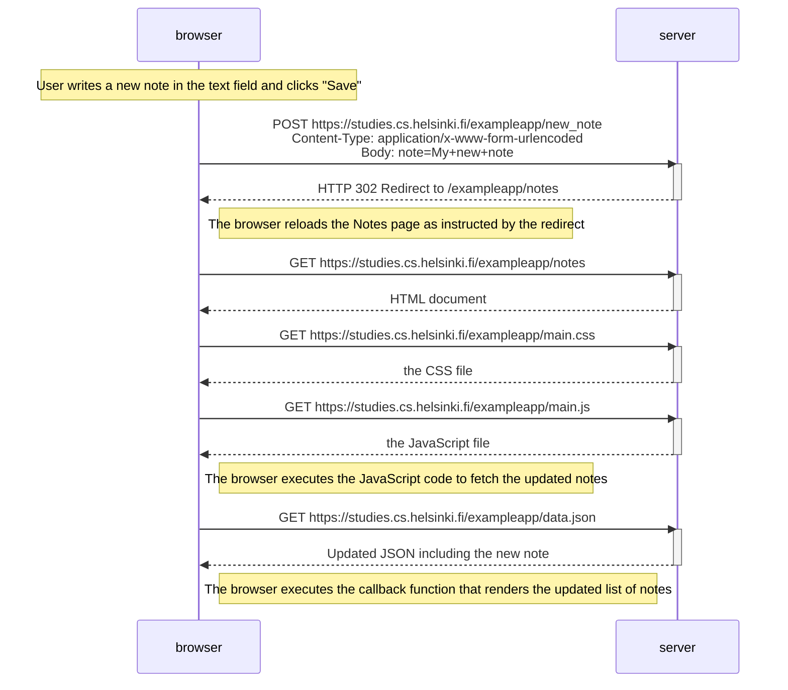
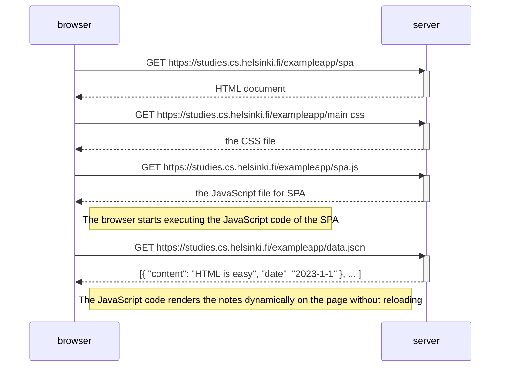
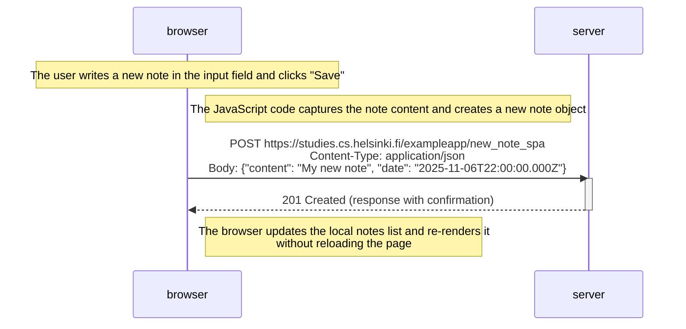

## Exercise 4:

```mermaid
sequenceDiagram
    participant browser
    participant server

    Note over browser: User writes a new note in the text field and clicks "Save"

    browser->>server: POST https://studies.cs.helsinki.fi/exampleapp/new_note<br>Content-Type: application/x-www-form-urlencoded<br>Body: note=My+new+note
    activate server
    server-->>browser: HTTP 302 Redirect to /exampleapp/notes
    deactivate server

    Note right of browser: The browser reloads the Notes page as instructed by the redirect

    browser->>server: GET https://studies.cs.helsinki.fi/exampleapp/notes
    activate server
    server-->>browser: HTML document
    deactivate server

    browser->>server: GET https://studies.cs.helsinki.fi/exampleapp/main.css
    activate server
    server-->>browser: the CSS file
    deactivate server

    browser->>server: GET https://studies.cs.helsinki.fi/exampleapp/main.js
    activate server
    server-->>browser: the JavaScript file
    deactivate server

    Note right of browser: The browser executes the JavaScript code to fetch the updated notes

    browser->>server: GET https://studies.cs.helsinki.fi/exampleapp/data.json
    activate server
    server-->>browser: Updated JSON including the new note
    deactivate server

    Note right of browser: The browser executes the callback function that renders the updated list of notes
```

## Exercise 5:

```mermaid
sequenceDiagram
    participant browser
    participant server

    browser->>server: GET https://studies.cs.helsinki.fi/exampleapp/spa
    activate server
    server-->>browser: HTML document
    deactivate server

    browser->>server: GET https://studies.cs.helsinki.fi/exampleapp/main.css
    activate server
    server-->>browser: the CSS file
    deactivate server

    browser->>server: GET https://studies.cs.helsinki.fi/exampleapp/spa.js
    activate server
    server-->>browser: the JavaScript file for SPA
    deactivate server

    Note right of browser: The browser starts executing the JavaScript code of the SPA

    browser->>server: GET https://studies.cs.helsinki.fi/exampleapp/data.json
    activate server
    server-->>browser: [{ "content": "HTML is easy", "date": "2023-1-1" }, ... ]
    deactivate server

    Note right of browser: The JavaScript code renders the notes dynamically on the page without reloading
```

## Exercise 6:

```mermaid
sequenceDiagram
    participant browser
    participant server

    Note over browser: The user writes a new note in the input field and clicks "Save"

    Note right of browser: The JavaScript code captures the note content and creates a new note object

    browser->>server: POST https://studies.cs.helsinki.fi/exampleapp/new_note_spa<br>Content-Type: application/json<br>Body: {"content": "My new note", "date": "2025-11-06T22:00:00.000Z"}
    activate server
    server-->>browser: 201 Created (response with confirmation)
    deactivate server

    Note right of browser: The browser updates the local notes list and re-renders it<br>without reloading the page
```